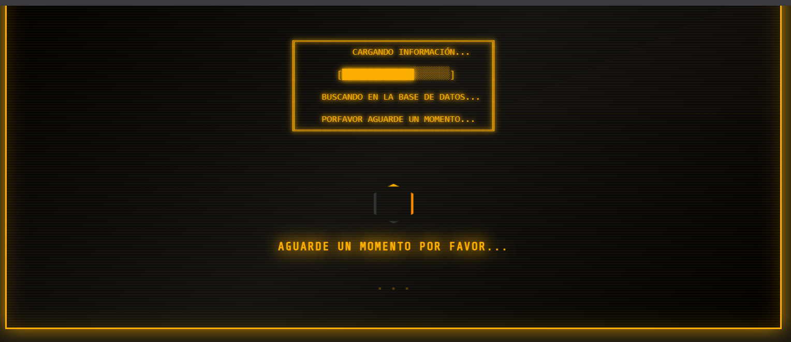
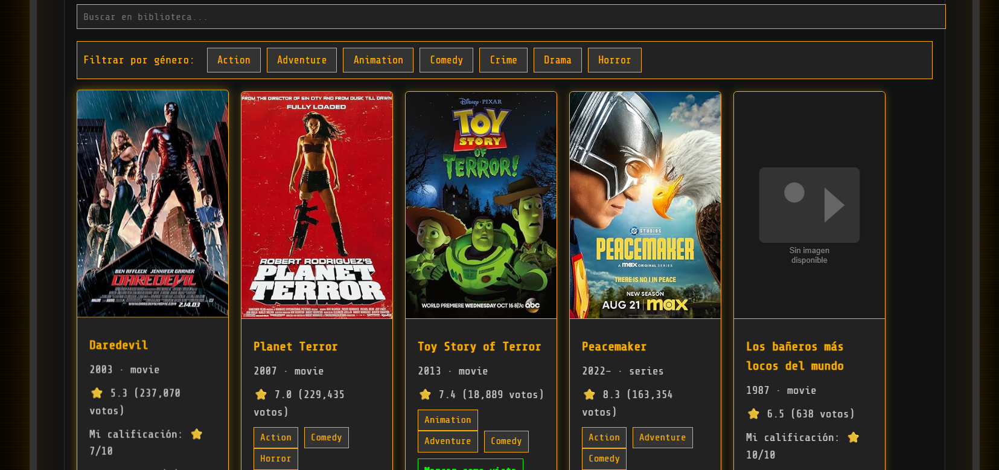
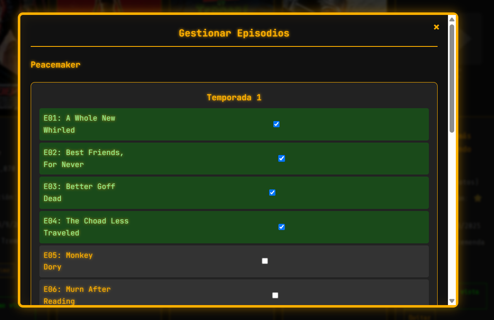
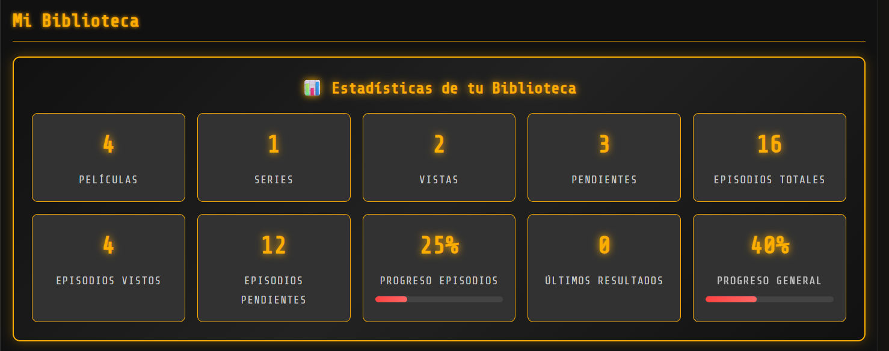

# Mi Biblioteca de Películas y Series - PWA

Una aplicación web progresiva (PWA) para gestionar tu biblioteca personal de películas y series. Utiliza la API de OMDB para buscar y obtener información detallada de películas y series.

## 🚀 Características

- **Búsqueda en OMDB**: Busca películas y series por título.
- **Biblioteca personal**: Agrega películas/series a tu colección.
- **Marcar como visto**: Marca elementos como vistos y agrega calificaciones personales.
- **Comentarios**: Agrega comentarios a tus películas vistas.
- **Búsqueda en biblioteca**: Filtra tu biblioteca por título.
- **PWA**: Instálala como app en tu dispositivo.
- **Offline**: Funciona sin conexión gracias al Service Worker.
- **Responsive**: Diseño adaptable a móviles y desktop.

## 📋 Requisitos

- Navegador moderno con soporte para PWA (Chrome, Firefox, Edge).
- Conexión a internet para búsquedas (funciona offline una vez cargada).
- Clave API de OMDB (gratuita en https://www.omdbapi.com/apikey.aspx).

## 🛠️ Instalación

1. Clona el repositorio:
   ```bash
   git clone https://github.com/tu-usuario/mi-biblioteca-pelis.git
   cd mi-biblioteca-pelis
   ```

2. Abre el archivo `index.html` en un servidor local.

   **Opción 1: Usando Python**
   ```bash
   python -m http.server 8000
   ```
   Abre http://localhost:8000 en tu navegador.

   **Opción 2: Usando Node.js**
   ```bash
   npx serve .
   ```

   **Opción 3: Usando VS Code Live Server**
   Instala la extensión "Live Server" y abre el archivo con "Open with Live Server".

3. Obtén una clave API de OMDB y reemplaza `'TU_API_KEY_AQUI'` en el código con tu clave.

## 📖 Uso

1. **Buscar películas/series**: Escribe un título en el campo de búsqueda y presiona Enter.
2. **Agregar a biblioteca**: Haz clic en "Agregar a Biblioteca" en los resultados.
3. **Marcar como visto**: En tu biblioteca, haz clic en "Marcar como vista" para calificar y comentar.
4. **Buscar en biblioteca**: Usa el campo de búsqueda en "Mi Biblioteca" para filtrar.
5. **Instalar PWA**: En Chrome, haz clic en "Instalar" en la barra de direcciones.

## 🏗️ Tecnologías

- **HTML5**: Estructura de la aplicación.
- **CSS3**: Estilos y diseño responsive.
- **JavaScript (ES6+)**: Lógica de la aplicación.
- **OMDB API**: Fuente de datos para películas y series.
- **Service Worker**: Funcionalidad offline.
- **Web App Manifest**: Para PWA.

## 📱 Capturas de Pantalla

### Pantalla Principal

*Interfaz principal con búsqueda y estadísticas*

### Resultados de Búsqueda

*Búsqueda de películas con chips de género clickeables*

### Biblioteca Personal

*Gestión de tu biblioteca con filtros y estadísticas detalladas*

### Gestión de Episodios

*Modal para marcar episodios de series como vistos*

### Versión Móvil

*Diseño responsive adaptado para dispositivos móviles*

### Panel de Estadísticas

*Estadísticas completas de películas, series y episodios*

## 🤝 Contribuir

¡Las contribuciones son bienvenidas! Por favor, sigue estos pasos:

1. Fork el proyecto.
2. Crea una rama para tu feature (`git checkout -b feature/nueva-funcionalidad`).
3. Commit tus cambios (`git commit -m 'Agrega nueva funcionalidad'`).
4. Push a la rama (`git push origin feature/nueva-funcionalidad`).
5. Abre un Pull Request.

## 📄 Licencia

Este proyecto está bajo la Licencia MIT. Ver el archivo [LICENSE](LICENSE) para más detalles.

## 🙏 Agradecimientos

- [OMDB API](https://www.omdbapi.com/) por proporcionar los datos.
- Guillermo Cochrane y Emanuel  Perna por inspiración  de sabado a la tarde y los mates 🧉 🚀

---

**Powered by Diego Markiewicz** ⚡  
📧 Email: [dieghard@gmail.com](mailto:dieghard@gmail.com)

## 📞 Contacto

Si tienes preguntas o sugerencias, abre un issue en GitHub.

---

¡Disfruta gestionando tu biblioteca de películas y series! 🍿🎥